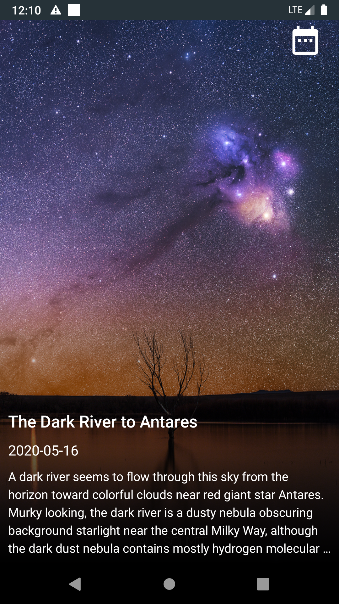
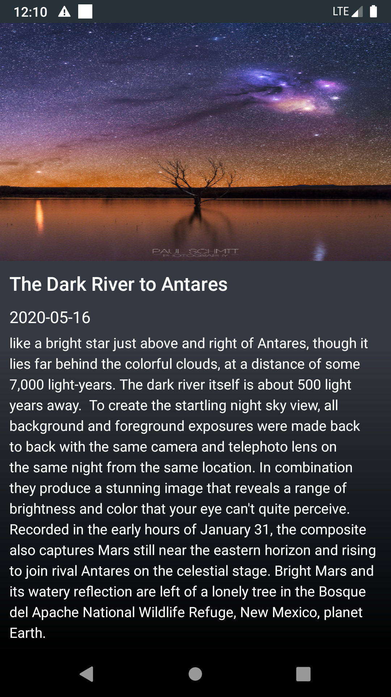

# About

This application gets the Astronomy Picture of the Day (APOD)  data from Nasa's public api with DEMO_KEY as the api key.

## This app uses  

- **MVVM** architecture to create a maintainable, scalable and testable code.
- **Retrofit 2** for making the HTTP calls.
- **Dagger 2** for dependency injection.
- **RxJava** to make the network calls asynchronous.
- **JUnit4, Mockito** for local unit testing.
- **Espresso** for UI testing.

This app also features a DatePicker Dialog which can be used to pick any date which is <= today's date and can be used to fetch the APOD data for the picked date.
